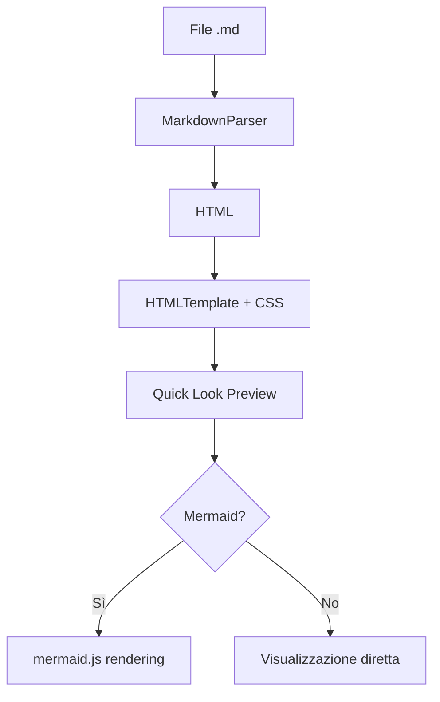
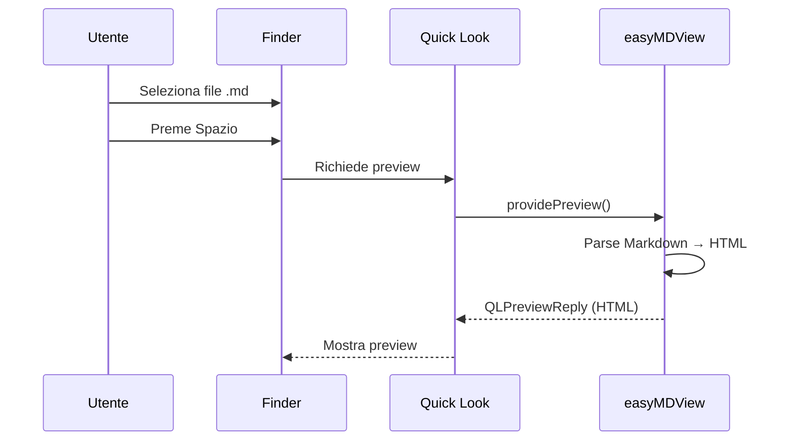

# Test easyMDView

Questo file testa la preview Markdown formattata.

## Formattazione testo

Testo **bold**, *italic*, ~~barrato~~ e `codice inline`.

Un [link a Google](https://google.com) e del testo normale.

## Blockquote

> Questa è una citazione con **formattazione** interna.
> Può avere più righe.

## Lista

- Primo elemento
- Secondo elemento
  - Sotto-elemento
  - Altro sotto-elemento
- Terzo elemento

## Tabella

| Servizio | URL | Stato |
|----------|-----|-------|
| **Web App** | https://localhost:8090 | Attivo |
| **Database** | localhost:5433 | Attivo |
| **Cache** | localhost:6379 | Attivo |

## Blocco di codice

```swift
struct ContentView: View {
    var body: some View {
        Text("Hello, World!")
            .padding()
    }
}
```

## Diagramma Mermaid



## Sequence Diagram



---

*Fine del test.*
